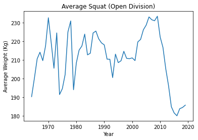

# Power-Lifting-Analysis

## Overview
In this project, powerlifting data was analyzed to determine how the Powerlifting Open Division has changed over time. The dataset was downloaded from Kaggle on this [webpage](https://www.kaggle.com/datasets/open-powerlifting/powerlifting-database). The dataset includes several divisions, but Open Division was chosen exclusively because it is open to all age and weight classes, which makes the data more generalizable to all powerlifters.

## Results

As seen in the line chart below, women have been gradually making up more of the participation pool in the Open Division. In 1980, women made up 10% of participants. From 1980 to 1985, participation jumped to 25%. This make-up was maintained from 1985 until around 2010, when it quickly jumped to roughly 33%, or a third of all participants. Although women are still largely the minority in this male-dominated sport, their involvement has shown sharp, sudden change over the last several deacdes. 

Other demographics have changed as well. In 1964, the age of the average powerlifter was 22, but has increased to ove 30 in recent years. The average bodyweight used to hover around 80 Kg but now is around 88 kg, almost a 20 pound difference. More muscle means a heavier bodyweight, so this trend could be the result of the need to have larger muscles in order to stay competitive. Gaining this kind of muscle growth would require many years of training, which could also explain the increase in age. These are merely speculations, of course. 

The oscilation in the squat and bench press makes it difficult to find any trend in the data, but the average deadlift seems to be steadily decreasing in weight. This is surprising considering that the average weight of competitors has increased overtime. In addition, the the total weight lifting from the three events has been in decline, likely because of the decline in the bench press.

The equipment used has also changed overtime. In the 1960s, wraps were used exclusively. But as the sport evolved, wraps were abandaned for more novel equipment, such as straps. One of the most popular equipment choices in the last decade is "Raw", where competitors use no additional equipment while competing. This option had been rarely chosen prior to 2010. From the 1980s until the early 2000s, single-ply was almost exclusively used, but has decrased over the last decade. Despite the increase in use of straps, this equipment is still seldom used. 

 

## Conclusion

Powerlifting has changed in various ways since the 1960s. Women are participating more frequently and the age and weight of participants has sharply increased. Unfortunately, this data only illustrates these changes, rather than telling us why these changes have occured. Future work should analyze the data of other divisions, including comparisons among multiple divisions. These analyses could bring insight as to which divisions are most successful or unique in their performance.   
